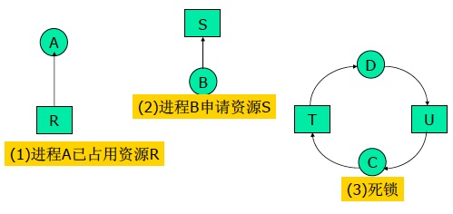

# 第二章 进程与线程

## 进程的三种状态

- 运行态：该时刻进程实际占用CPU
- 就绪态：可运行，但因为其他进程正在运行而暂时停止
- 阻塞态：除非某种外部事件发生，否则进程不能运行


1. 进程因为等待输入而被阻塞
2. 调度程序选择另一个进程
3. 调度程序选择这个进程
4. 出现有效输入

## 进程控制块（Process Control Block）

- 进程由程序、数据以及进程控制块组成。
- 进程控制块是进程实体的一部分，是操作系统中最重要的记录型数据结构。OS利用PCB来描述进程的基本情况以及进程的运行变化过程。
- PCB是进程存在的唯一标志。

### PCB的内容

- 进程标束符信息：外部标识符、内部标识符（PID）
- 处理机状态信息：通用寄存器、指令计数器、程序状态字PSW、用户栈指针
- 进程调度信息：进程状态、进程优先级、进程调度所需的其它信息(CPU的时间总和等)
- 进程控制信息：程序和数据的地址、进程同步和通信机制(消息队列、信号灯)、资源清单(父进程、子进程)、PCB链接指针

## 线程控制块

- TID
- 程序计数器
- 寄存器
- 堆栈
- 状态

## 进程和线程的比较（为什么引入线程）

线程：具有许多传统进程所具有的特征，因此又称“轻型进程” Light-Weight Process

传统进程：又称为“重型进程” Heavy-Weight Process

- 调度
    - 传统OS中，拥有资源的基本单位和独立调度、分派的基本单位是进程；引入线程的OS中，把线程作为调度、分派的基本单位，而把进程作为资源拥有的基本单位。（即两个属性分开了）
    - 在同一进程中，线程的切换不会引起进程的切换；在由一个进程中的线程切换到另一个进程中的线程时会引起进程的切换。
- 并发性
    - 引入线程的OS中，不仅进程之间可以并发执行，而且在一个进程中的多个线程之间也可以并发执行，因此更具有并发性，更有效地使用系统资源和提高系统吞吐量。（多线程的文件服务器）
- 拥有资源
    - 线程自己不拥有系统资源，但它可以访问其隶属进程的资源，即一个进程的代码段、数据段以及系统资源(已打开的文件、I/O设备)
- 系统开销
    - 进程的开销明显大于线程的开销，无论是创建、撤销、转换。
- 从地址空间资源上比较
    - 不同的进程的地址空间是相互独立的，而同一进程的各线程共享同一地址空间，一个进程中的线程在另一个进程中是不可见的
- 从通信关系上比较
    - 进程间通信必须使用操作系统提供的进程间通信机制，而同一进程的各线程可通过直接读写进程数据段来进程通信，当然同一进程的各线程间通信也需要同步和互斥手段的辅助，以保证数据一致性
- 从调度切换上比较
    - 同一进程中的线程上下文切换比进程的上下文切换要快得多

## 线程的实现方式

- 用户级线程
- 内核级线程
- 混合实现（一些内核级线程会被多个用户级线程多路复用）

### 区别

1. 内核支持线程是OS内核可感知的，而用户级线程是OS内核不可感知的。
2. 用户级线程的创建、撤消和调度不需要OS内核的支持，是在语言（如Java）这一级处理的；而内核支持线程的创建、撤消和调度都需OS内核提供支持，而且与进程的创建、撤消和调度大体是相同的。
3. 用户级线程的程序实体是运行在用户态下的程序，而内核支持线程的程序实体则是可以运行在任何状态下的程序。
4. 线程的调度与切换速度
    - 两种线程的调度与切换相似，线程的调度方式也都有两种方式：抢占方式和非抢占方式
    - 用户级线程的切换不需要通过中断进入OS的内核，因此切换的规则比进程的调度、切换规则简单得多
5. 线程执行时间
    - 用户级线程的系统，调度是以进程为单位；
    - 内核支持线程的系统，调度是以线程为单位的。
6. 系统调用
    - 传统的用户进程调用一个系统调用时，要由用户态转入核心态，用户进程将被阻塞，当内核完成系统调用而返回时，才将该进程唤醒，继续执行
    - 而用户级线程调用一个系统调用时，由于内核并不知道有该用户级线程的存在，因此把系统调用看作是整个进程的行为，于是使该进程等待，而调度另一个进程执行，同样是在内核完成系统调用返回时，进程才继续执行
    - 对于内核支持线程，调度是以线程为单位，当其调用一个系统调用时，内核把系统调用只看作是该线程的行为，因而阻塞该线程，于是可以再调度该进程中的其它线程执行

### 内核级线程
#### 优点：
1. 当有多个处理机时，一个进程的多个线程可以同时执行。

#### 缺点
1. 由内核进行调度。

### 用户级线程
#### 优点：
1.  线程的调度不需要内核直接参与，控制简单。
2.  可以在不支持线程的操作系统中实现。
3.  创建和销毁线程、线程切换代价等线程管理的代价比内核线程少得多。
4.  允许每个进程定制自己的调度算法，线程管理比较灵活。这就是必须自己写管理程序，与内核线程的区别
5.  线程能够利用的表空间和堆栈空间比内核级线程多。

#### 缺点：

1.  同一进程中只能同时有一个线程在运行，如果有一个线程使用了系统调用而阻塞，那么整个进程都会被挂起。另外，页面失效也会产生同样的问题。
2. 资源调度按照进程进行，多个处理机下，同一个进程中的线程只能在同一个处理机下分时复用

## 	引入线程时 原来进程模型的函数会不会有问题 比如全局数据 特权指令 怎么解决

- 全局变量
    - way1:映射为线程私有变量
    - way2:引入新的库过程
        ```c++
        create_global("bufptr");
        set_global("bufptr", &buf);
        bufptr = read_global("bufptr");
        ```
- 不可重入库函数的问题
    - such as malloc, stdio functions
    - way1:重写库过程
    - way2:为每个过程提供包装器，同一个过程一个时间只允许一个线程执行
- 信号接收处理问题
    - 线程专用信号、进程信号
- 多线程的堆栈管理问题
    - 传统进程中堆可自动增长，而多线程环境下要三思
    - 重写库的同时，还要考虑兼容原有程序的问题

## 进程间可能存在的关系
- 资源共享关系
    - 进程之间彼此无关，相互也不知道对方的存在，但使用了相同了资源
- 相互合作关系
    - 进程之间存在逻辑业务上的相互合作关系
    - 例如：输入进程、计算进程和打印进程三者配合完成某项业务。

## 进程间通信概念
**竞争条件**：当类似两个或多个进程读写某些共享数据，而最后的结果取决于进程运行的精确时序的，称为竞争条件
**临界资源**：多进程存在时必须互斥地访问的资源
**临界区**：把对临界资源进行访问的程序片断称作临界区域或临界区
**目标**：有效防止竞争条件又能最大化保证使用共享数据的并发进程
**好的解决方案的标准**：
1. 任何两个进程不能同时处于临界区
1. 不应对CPU的速度和数目做任何假设
1. 临界区外运行的进程不得阻塞其它进程
1. 不得使进程在临界区外无休止地等待

## 忙等待的互斥
- 本质：想进入临界区,先检查是否允许进入,若不允许就等待,重复循环检测
- 缺点：忙等待
- 优先级反转问题
    - 例:两个进程H和L,H的优先级高于L,L处于临界区中,此时H变到就绪态准备运行,H开始忙等待,而此时L不会被调度也就无法离开临界区,所以将永远忙等待下去。

### 方法
1. 屏蔽中断
2. 锁变量
3. 严格轮换法
4. Peterson解法
5. TSL指令
6. Swap指令

### 屏蔽中断
**缺点**：将关闭中断的权利交给用户进程，不明智
### 设置锁变量
设置一个共享变量,0与1等，先测试再进入临界区
问题：所变量仍然是临界资源
### 严格轮换法
- 忙等待，自旋锁
- 当两个进程在临界区需要CPU时间相差很大时，此方法并不好违反了**临界区外运行的进程不得阻塞其它进程**
### Peterson解法

```cpp
#define FALSE 0
#define TRUE 1
#define N 2	/*number of processes*/
int turn; /*whose turn is it?*/
int interested[N]; /*all values initially 0*/
void enter_region(int process)
{
    int other;
    other=1-process;
    interested[process]=TRUE;
    turn=process;
    while(turn==process && interested[other]==TRUE);
}
void leave_region(int process)
{
    interested[process]=FALSE;
}
```

### TSL指令
- (test and set lock)测试并上锁
- 工作原理:其将内存中一个指定的存储器字读到一个指定的寄存器中，然后在该内存地址上存一个非零值。读数与写数操作是绝对不可分割的。

### Swap指令
- 交换指令:XCHG指令，用于交换两个字的内容，可替代TSL指令

## 睡眠与唤醒

新的解决思路：通信原语
- 睡眠SLEEP：该进程被挂起
- 唤醒WAKEUP：该进程被唤醒
- 潜在的竞争条件：存在两个进程都永远睡眠的可能。
- 需要增加唤醒等待位

## 信号量（semaphore）

- `DOWN()`
- `UP()`

## 互斥量（mutex）

## 事件计数器
- Read(E) 返回E的当前值
- Advance(E) 给E的值增1（原子操作）
- Await(E,v) 等待直到E>=v

## 管程

- 条件变量
- wait()
- signal()

## 屏障

例:计算火烧金属板一角时各点温度值。  
1)计算当前值,建立矩阵105*105  
2)ΔT,通过多个进程并行计算，得出一系列矩阵  
**第n+1次开始迭代时必须等到第n次迭代结束**

## 进程通信

进程通信是指进程之间的信息交换。进程的互斥和同步可归结为低级通信。

### 信号量机制作为通信工具的不足
- 效率低:生产者每次只能向缓冲区中投放一个消息
- 通信对用户不透明:程序员必须从低层来实现

### 进程通信的类型
- 共享内存(Shared-Memory System)
- 消息传递(Message passing System)
- 管道通信(Pipe System)

### 共享内存

在相互通信的进程之间设有一个公共内存区，一组进程向该公共内存中写，另一组进程从从公共内存中读，通过这种方式实现两组进程间的信息交换
- 需解决的两个问题
    - 怎样提供共享内存
    - 公共内存中的读写互斥问题

### 消息传递系统

进程间的数据交换以消息message为单位
- 计算机网络中，又将message称为报文
- 程序员直接利用系统提供的一组通信原语来实现通信
- `Send(destination,&message)`
- `Receive(source,&message)`

### 管道通信

- 管道通信基于文件系统
- 是指用于连接一个读进程和一个写进程，以实现它们之间通信的共享文件，又称pipe文件
- 向管道提供输入的发送进程即写进程，以字符流形式将大量的数据送入管道；而接收管道输出的接收进程即读进程，可从管道中接收数据。
- 适合于传送大量数据，数据长度可变
- 缺点：通信速度较慢
- 管道通信机制必须提供的三方面协调能力
    - 互斥:当一个进程正在对管道读/写时，另一进程必须等待；
    - 同步:当写进程把一定数量数据写入pipe后，便睡眠，直到读进程取走数据后再把它唤醒；当读进程读一空pipe时，也应睡眠，直到写进程将数据写入管道后，才将它唤醒
    - 对方是否存在:只有确定对方已存在时，方能进行通信

## 哲学家就餐问题

```c
#define N 5
#define LEFT (i+N-1)%N
#define RIGHT (i+1)%N
#define THINKING 0
#define HUNGRY 1
#define EATING 2
typedef int semaphore;
int state[N];
semaphore mutex=1;
semaphore s[N];
void philosopher(int){
    while(TRUE){
        think();
        take_forks(i);
        eat();
        put_forks(i);
    }
}
void take_forks(int i){
    down(&mutex);
    state[i]=HUNGRY; test(i);
    up(&mutex);
    down(&s[i]);
}
void put_forks(int i){
    down(&mutex);
    state[i]=THINKING;
    test(LEFT); test(RIGHT);
    up(&mutex);
}
void test(int i){
    if(state[i]==HUNGRY && state[LEFT]!=EATING
    && state[RIGHT]!=EATING){
        state[i]=EATING;
        up(&s[i]);
    }
}
```

## 读者写者问题

### 读者优先

```c
int count = 0;          // 用于记录当前的读者数量
semaphore mutex = 1;    // 用于保护更新count变量时的互斥
semaphore rw = 1;       // 用于保证读者和写者互斥地访问文件
// 写者进程
void writer () {
    while(1){
        down(&rw);      // 互斥访问共享文件
        writing();      // 写入
        up(&rw);        // 释放共享文件
    }
}
// 读者进程
void reader () {
    while(1){
        down(&mutex);   // 互斥访问count变量
        if (count == 0) // 当第一个读进程读共享文件时
            down(&rw);  // 阻止写进程写
        count++;        // 读者计数器加1
        up(&mutex);     // 释放互斥变量count
        reading();      // 读取
        down(&mutex);   // 互斥访问count变量
        count--;        // 读者计数器减1
        if (count == 0) // 当最后一个读进程读完共享文件
            up(&rw);    // 允许写进程写
        up(&mutex);     // 释放互斥变量 count
    }
}
```

### 写者优先

```c
typedef int semaphore
int wcount = 0;
int rcount = 0;
semaphore wsem = 1;
semaphore rsem = 1;
semaphore x = 1;
semaphore y = 1;
semaphore z = 1;
// 写者进程
void writer () {
    while(1){
        down(&y);
        wcount++;
        if (wcount == 1)
            down(&rsem);
        up(&y);
        down(&wsem);
        writing();
        up(&wsem);
        down(&y);
        wcount--;
        if (wcount == 0)
            up(&rsem);
        up(&y);
    }
}
// 读者进程
void reader () {
    while (1){
        down(&z);
        down(&rsem);
        down(&x);
        rcount++;
        if (rcount == 1)
            down(&wsem);
        up(&x);
        up(&rsem);
        up(&z);
        reading();
        down(&x);
        rcount--;
        if (rcount == 0)
            up(&wsem);
        up(&x);
    }
}
```

## 睡眠的理发师

```c
// #define CHAIRS 5
typedef int semaphore;
semaphore customers = 0;
semaphore barbers = 0;
semaphore mutex = 1;
int waiting = 0;
void barber (void) {
    while (1) {
        down(&customers);
        down(&mutex);
        waiting = waiting - 1;
        up(&barbers);
        up(&mutex);
        cut_hair();
    }
}
void customer (void) {
    down(&mutex);
    if (waiting < CHAIRS) {
        waiting = waiting + 1;
        up(&customers);
        up(&mutex);
        down(&barbers);
        get_haircut();
    }
    else {
        up(&mutex);
    }
}
```

## 调度
### 3+1调度模型
#### 3
- 作业调度
- 存储调度
- 进程调度
#### 1
- 线程调度

### 进程行为
- 计算密集型
- IO密集型

### 何时调度
1. 在创建一个新进程之后，需要决定是运行父进程还是运行子进程
2. 在一个进程退出时必须做出调度决策。
3. 当一个进程阻塞在IO和信号量上或由于其他原因阻塞时，必须选择另一个进程运行。
4. 在一个IO中断发生时，必须做出调度决策。

### 调度算法按处理时钟中断分类
**非抢占式**：让进程运行直至被阻塞。  
**抢占式**：让该进程运行某个固定时段的最大值。

### 调度算法按照环境分类
- 批处理
- 交互式
- 实时

### 目标
- 公平——给每个进程公平的CPU份额
- 策略强制执行——保证规定的策略被执行
- 平衡——保持系统的所有部分都忙碌

## 调度算法

### 批处理系统中的调度
- 先来先服务
- 最短作业优先
- 最短剩余时间优先（最短作业优先的抢占式）

### 交互式系统中的调度
- 轮转调度
- 优先级调度
- 多级队列
- 最短进程优先
- 保证调度
- 彩票调度


## 死锁

### 四个必要条件
1. 互斥条件。每个资源要么已经分配给了一个进程，要么就是可用的。
2. 占有和等待条件。已经得到了某个资源的进程可以再请求新的资源。
3. 不可抢占条件。已经分配给了一个进程的资源不能强制性地被强占，他只能被占有它的进程显示地释放。
4. 环路等待条件。死锁发生时，系统中一定有两个或两个以上的进程组成的一条环路，该环路中的每个进程都在等待着下一个进程所占有的资源。

### 死锁建模


### 处理方法
1. 忽略该问题
2. 检测死锁并恢复
3. 仔细地对资源进行动态分配，以避免死锁
4. 通过破除所述四个必要条件之一，用以防止死锁产生

### 鸵鸟算法
- 视而不见
- 考虑以下三点：
    - 死锁发生的频度
    - 系统因各种原因崩溃的发生次数
    - 思索的严重性

### 每种类型一个资源的死锁检测
- 画系统资源分配图
- 存在环则为死锁

### 死锁的恢复
- 剥夺法恢复Recovery through preemption
    - 临时将某些资源从其持有者手里转移到另一个进程中
    - 往往需要人工干预
- 回退法恢复Recovery through rollback
    - 如果死锁行为都类似
    - 为进程设置检查点checkpoint,将进程的状态写入特定文件中以备重启：内存图像memory image、资源状态resource state
    - 周期地对进程进行检查
- 杀死进程来恢复Recovery through killing processes
    - 一种是杀死环中的某个进程：不能保证死锁的解除
    - 一种是杀死环外的某个进程
    - 原则是尽量杀死不重要或可重复执行不带副作用的进程

### 死锁的避免

### 死锁的预防
- 互斥 对所有资源进行Spooling
- 占有并等待 初始时申请所有资源
- 不可剥夺 将资源剥夺
- 循环等待 对资源进行顺序编号

### 活锁
处于活锁进程组里的进程状态可以改变，但是整个活锁组的进程无法推进

### 饥饿
进程在运行，理论上能够得到服务，实际上却永远得不到服务的。饥饿不是死锁，也没有被阻塞。

### 死锁与饥饿的区别
- 死锁是一种相互或循环等待的局面，且它们等待的事件是决不会发生的
- 被死锁的进程应该是两个或两个以上，一个进程不可能自己把自己锁上，除非出现了某种程序设计错误
- 饥饿不是循环等待的局面，而是一种单向等待，它们等待的事件不是没有发生，而是总被别的进程抢先以至于一直轮不到它们
- 饥饿的进程可能是一个或多个

