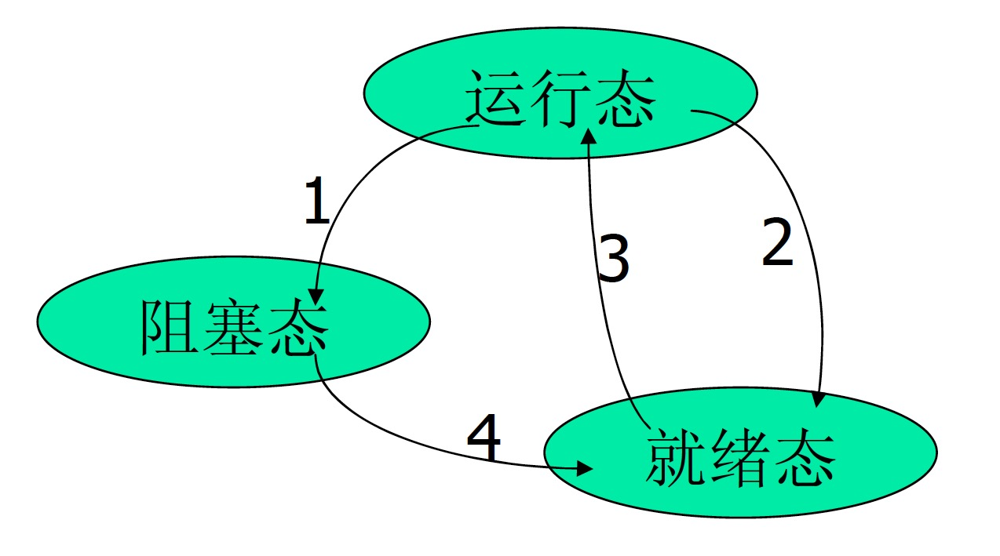

# 第二章 进程与线程

## 进程的三种状态

- 运行态：该时刻进程实际占用CPU
- 就绪态：可运行，但因为其他进程正在运行而暂时停止
- 阻塞态：除非某种外部事件发生，否则进程不能运行

	1. 进程因为等待输入而被阻塞
	2. 调度程序选择另一个进程
	3. 调度程序选择这个进程
	4. 出现有效输入

## 进程控制块（Process Control Block）

- 进程由程序、数据以及进程控制块组成。
- 进程控制块是进程实体的一部分，是操作系统中最重要的记录型数据结构。OS利用PCB来描述进程的基本情况以及进程的运行变化过程。
- PCB是进程存在的唯一标志。

### PCB的内容

- 进程标束符信息：外部标识符、内部标识符（PID）
- 处理机状态信息：通用寄存器、指令计数器、程序状态字PSW、用户栈指针
- 进程调度信息：进程状态、进程优先级、进程调度所需的其它信息(CPU的时间总和等)
- 进程控制信息：程序和数据的地址、进程同步和通信机制(消息队列、信号灯)、资源清单(父进程、子进程)、PCB链接指针

## 线程控制块

- TID
- 程序计数器
- 寄存器
- 堆栈
- 状态

### 进程和线程的比较（为什么引入线程）

线程：具有许多传统进程所具有的特征，因此又称“轻型进程” Light-Weight Process

传统进程：又称为“重型进程” Heavy-Weight Process

- 调度
	- 传统OS中，拥有资源的基本单位和独立调度、分派的基本单位是进程；引入线程的OS中，把线程作为调度、分派的基本单位，而把进程作为资源拥有的基本单位。（即两个属性分开了）
	- 在同一进程中，线程的切换不会引起进程的切换；在由一个进程中的线程切换到另一个进程中的线程时会引起进程的切换。
- 并发性
	- 引入线程的OS中，不仅进程之间可以并发执行，而且在一个进程中的多个线程之间也可以并发执行，因此更具有并发性，更有效地使用系统资源和提高系统吞吐量。（多线程的文件服务器）
- 拥有资源
	- 线程自己不拥有系统资源，但它可以访问其隶属进程的资源，即一个进程的代码段、数据段以及系统资源(已打开的文件、I/O设备)
- 系统开销
	- 进程的开销明显大于线程的开销，无论是创建、撤销、转换。
- 从地址空间资源上比较
	- 不同的进程的地址空间是相互独立的，而同一进程的各线程共享同一地址空间，一个进程中的线程在另一个进程中是不可见的
- 从通信关系上比较
	- 进程间通信必须使用操作系统提供的进程间通信机制，而同一进程的各线程可通过直接读写进程数据段来进程通信，当然同一进程的各线程间通信也需要同步和互斥手段的辅助，以保证数据一致性
- 从调度切换上比较
	- 同一进程中的线程上下文切换比进程的上下文切换要快得多